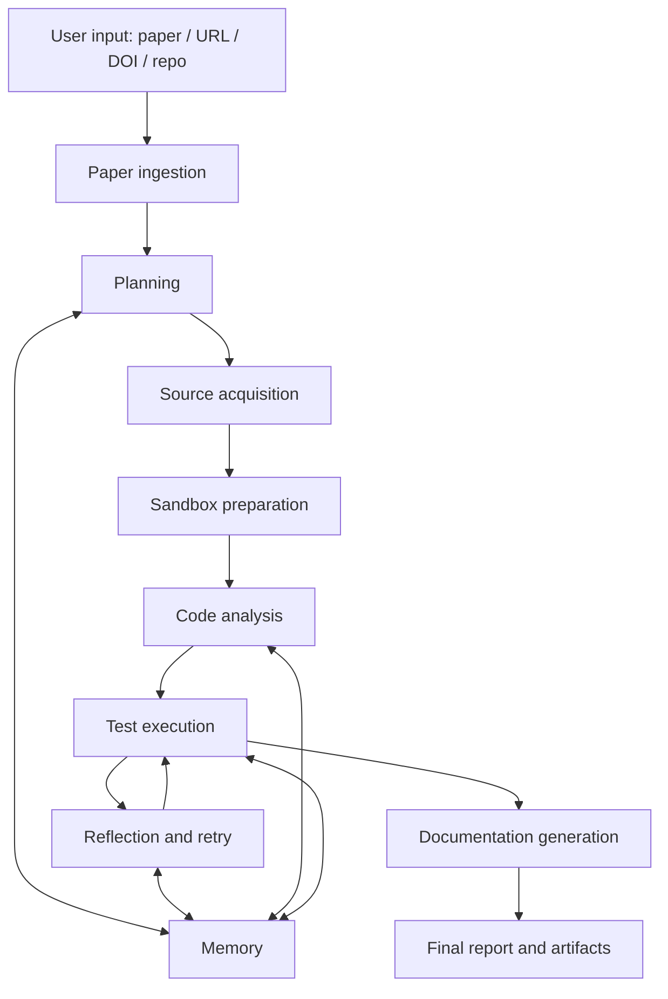

# 论文复现助手 Agent 详细设计说明书

> 适用于当前仓库的落地方案，兼顾现有实现、基础功能和后续扩展。
> 如果需要先看工程成熟度判断，可配套阅读 [项目解析与评估](project_analysis_and_assessment.md)。

## 1. 文档目的

本文档面向一个“论文复现助手”类型的 Agent。它的目标不是只会回答论文内容，而是能够把论文复现这件事拆成一条完整流水线：自动阅读用户提供的文章、自动获取完整源码、自动配置沙箱环境、自动执行测试、自动生成文档，并在失败时进行自我修正。

这意味着系统必须同时具备三类能力：

1. 理解论文与任务目标。
2. 获取、准备并执行代码与环境。
3. 产出可审计、可复现的文档与测试结果。

当前仓库已经有一个不错的 Agent 骨架，但要成为真正的论文复现助手，还需要把“工具层”和“执行闭环”补全。

## 2. 目标与范围

### 2.1 核心目标

1. 自动理解论文。
2. 自动定位和获取完整源码。
3. 自动分析源码结构、依赖与运行入口。
4. 自动创建沙箱环境并安装依赖。
5. 自动运行测试、复现脚本与验证流程。
6. 自动生成复现文档、过程记录和最终报告。
7. 在失败时进行诊断、修复建议和重新执行。

### 2.2 成功标准

1. 用户只提供论文文件、URL、DOI 或标题时，系统可以生成可执行复现计划。
2. 系统可以在本地或容器沙箱中完成源码下载、依赖安装和基础验证。
3. 系统可以输出结构化的执行记录、错误分析和最终报告。
4. 系统可以在失败后进行至少一轮有效的反思和重试。
5. 系统所有关键动作都可追踪、可回放、可审计。

### 2.3 非目标

1. 不承诺所有论文都可以完全自动复现。
2. 不承诺在缺少源码、数据或专有环境的情况下仍能无条件成功。
3. 不做无边界的网络抓取或高风险自动执行。
4. 不把大模型当作唯一决策源，必须保留规则、工具和验证层。

## 3. 任务画像

论文复现助手的典型任务不是单一步骤，而是一条长链路：

1. 读论文，提取研究目标、方法、数据集、指标和依赖。
2. 找源码，确认是否有仓库、补充材料、脚本和配置。
3. 搭环境，识别语言、框架、依赖和运行方式。
4. 跑测试，先做静态分析和基础健康检查，再进入复现验证。
5. 写文档，把过程、异常、结果和结论沉淀下来。
6. 失败时，调整策略、修复环境或改用替代路径。

这个任务的特点是：

1. 输入不稳定，来源可能是 PDF、网页、仓库、压缩包或文本片段。
2. 执行链路长，且每一步都可能失败。
3. 结果不确定，必须有中间态和回滚能力。
4. 需要强审计，后续用户要知道“为什么这样做”和“做了什么”。

## 4. 总体架构



### 4.1 现有仓库的角色映射

当前仓库已经具备以下核心模块：

| 现有模块                                            | 作用               | 在论文复现助手中的定位   |
| --------------------------------------------------- | ------------------ | ------------------------ |
| [app/agent/planner.py](../app/agent/planner.py)     | 目标拆解与重规划   | 复现任务 DAG 生成器      |
| [app/agent/react.py](../app/agent/react.py)         | 行动决策与工具调用 | 工具路由与执行调度器     |
| [app/agent/reflexion.py](../app/agent/reflexion.py) | 错误分析与修复建议 | 失败诊断与自我修正器     |
| [app/agent/memory.py](../app/agent/memory.py)       | 记忆存储           | 经验库与任务案例库       |
| [app/agent/state.py](../app/agent/state.py)         | 状态机             | 复现生命周期控制器       |
| [app/core/context.py](../app/core/context.py)       | 执行上下文         | 全局运行上下文与产物索引 |
| [app/core/llm.py](../app/core/llm.py)               | LLM 接口           | 结构化推理与抽取服务     |
| [app/tools/__init__.py](../app/tools/__init__.py)   | 工具注册表         | 工具系统的入口           |
| [app/streamlit_app.py](../app/streamlit_app.py)     | UI                 | 过程可视化和人工接管界面 |

结论是：核心编排骨架已经存在，缺的是面向“论文复现”任务域的具体工具和数据模型。

## 5. 生命周期设计

建议把 Agent 的生命周期定义为以下状态：

1. `idle`
2. `ingesting_paper`
3. `extracting_requirements`
4. `acquiring_source`
5. `analyzing_source`
6. `preparing_sandbox`
7. `running_replication`
8. `reflecting`
9. `documenting`
10. `finalizing`
11. `completed`
12. `failed`
13. `needs_user_input`

### 5.1 状态迁移原则

1. 任何状态都应保留可恢复信息。
2. 任何失败都应记录失败点、原因和下一步。
3. 只有在达到明确的完成条件后才进入 `completed`。
4. 遇到缺失信息时，不要盲目失败，应进入 `needs_user_input`。

### 5.2 终止条件

1. 复现目标完成。
2. 达到最大执行步数。
3. 连续失败且无可用修复路径。
4. 用户明确中止。

## 6. 核心模块设计

### 6.1 论文理解模块

这个模块负责把论文变成结构化任务描述，而不是只做摘要。

#### 输入

1. PDF 文件。
2. 论文网页。
3. DOI 或 arXiv 标识。
4. 纯文本或用户粘贴内容。

#### 输出

1. 论文元数据。
2. 核心贡献点。
3. 方法步骤。
4. 依赖清单。
5. 数据集与评估指标。
6. 复现风险点。
7. 复现任务列表。

#### 关键能力

1. 标题、摘要、方法、实验、结论抽取。
2. 表格、图注、脚注和引用解析。
3. 复现要素识别：模型、数据、超参、训练脚本、指标、硬件约束。
4. 结果表格的结构化抽取。
5. 纸面风险判断：缺数据、缺代码、缺版本、缺细节。

#### 推荐实现

1. PDF 解析：`PyMuPDF`。
2. 网页抽取：`trafilatura`。
3. OCR 兜底：`tesseract` 或云 OCR。
4. 结构化抽取：大模型 + 规则混合。

### 6.2 源码获取模块

这个模块的目标是“尽量拿到完整、可验证、可追溯的源码包”。

#### 来源优先级

1. 用户提供的仓库链接。
2. 论文中的官方代码链接。
3. Supplementary materials。
4. GitHub / GitLab / Hugging Face / Gitee 搜索结果。
5. 发布包、压缩包或镜像仓库。

#### 处理流程

1. 解析论文中的代码线索。
2. 搜索候选仓库并计算置信度。
3. 下载源码并记录来源、commit、tag、license。
4. 识别主入口、依赖文件、测试文件和运行脚本。
5. 生成源码完整性报告。

#### 完整性判断

建议至少检查以下项：

1. 是否有 README 或运行说明。
2. 是否有依赖文件，例如 `requirements.txt`、`pyproject.toml`、`package.json`、`pom.xml`。
3. 是否有测试文件或示例脚本。
4. 是否有论文中提到的训练、评估或推理入口。
5. 是否存在大文件、模型权重或外部数据下载脚本。

#### 输出

1. `SourceBundle`。
2. 来源置信度。
3. 下载哈希和版本信息。
4. 目录结构摘要。

### 6.3 沙箱与环境模块

沙箱是这个项目的安全边界，也是可复现性的基础。

#### 原则

1. 每个复现任务使用独立工作区。
2. 默认隔离网络和宿主机敏感路径。
3. 默认限制 CPU、内存和执行时间。
4. 默认只给最小权限。
5. 所有安装和执行动作可回放。

#### 推荐分层

1. 任务工作区：保存源码、日志、文档和产物。
2. 运行沙箱：容器或虚拟环境，负责执行命令。
3. 缓存层：加速依赖下载，但不能污染任务隔离性。
4. 产物层：保存结果文件、截图、报告、模型输出。

#### 环境自动识别

系统应自动检测：

1. Python / Node.js / Java / Rust / Go 等语言。
2. 依赖管理方式。
3. 是否需要 GPU。
4. 是否需要特定系统库。
5. 是否需要数据下载或预处理步骤。

#### 推荐安全策略

1. 默认使用容器沙箱。
2. 网络访问采用 allowlist。
3. 高风险命令需要确认。
4. 命令执行必须带超时和日志。
5. 每次运行都写入审计日志。

### 6.4 测试与验证模块

论文复现助手的测试不是简单的单测，而是多层验证。

#### 测试层级

1. 静态检查：语法、格式、依赖、导入、类型。
2. 单元测试：核心函数和工具逻辑。
3. 烟雾测试：最小运行路径是否可执行。
4. 集成测试：关键模块联动是否正常。
5. 复现测试：论文脚本或主实验是否可跑通。
6. 行为对比：结果是否接近论文报告。

#### 自动测试策略

1. 先做低成本测试，再做高成本测试。
2. 先验证环境，再验证运行，再验证指标。
3. 失败时记录具体阶段，而不是只记“失败”。
4. 复现测试失败后触发 Reflexion。

#### 测试输出

1. 测试命令。
2. 返回码。
3. 标准输出和标准错误。
4. 耗时。
5. 失败分类。
6. 相关产物路径。

### 6.5 文档生成模块

文档生成不是最后补充，而是 Agent 工作的一部分。

#### 文档类型

1. 论文理解摘要。
2. 复现计划。
3. 环境搭建说明。
4. 执行日志。
5. 错误分析与修复记录。
6. 最终复现报告。
7. 未完成项和后续建议。

#### 输出目录建议

1. `docs/`：面向用户的正式文档。
2. `workspace/<user>/<run>/reports/`：运行报告。
3. `workspace/<user>/<run>/logs/`：过程日志。
4. `workspace/<user>/<run>/artifacts/`：截图、模型输出、指标文件。

#### 文档模板建议

1. 论文信息页。
2. 源码来源页。
3. 环境说明页。
4. 运行步骤页。
5. 结果页。
6. 失败与修复页。

### 6.6 Orchestrator：Planner + ReAct + Reflexion + Memory + State

当前仓库已有这五个核心模块，建议继续沿用，但需要把它们明确绑定到论文复现任务。

#### Planner

职责是把论文复现拆成任务图，而不是只拆成线性步骤。

建议 Planner 输出的步骤包含：

1. 任务类型。
2. 依赖关系。
3. 期望产物。
4. 验收条件。
5. 失败回退策略。

#### ReAct

职责是根据当前状态决定下一步动作。

建议 ReAct 能够在以下动作之间切换：

1. 读取论文。
2. 搜索源码。
3. 下载仓库。
4. 配置环境。
5. 运行测试。
6. 写文档。
7. 请求用户补充信息。

#### Reflexion

职责是把失败变成下一个可执行策略。

建议它支持以下错误类别：

1. 源码缺失。
2. 依赖冲突。
3. 环境缺失。
4. 命令超时。
5. 测试失败。
6. 结果不一致。
7. 权限问题。

#### Memory

职责是沉淀复现经验。

建议至少记住：

1. 某类论文常见代码来源。
2. 常见环境冲突模式。
3. 常见测试失败模式。
4. 可重复使用的修复策略。

#### State

职责是控制生命周期，避免任务混乱。

建议状态切换必须和产物落盘绑定，例如：进入 `completed` 前必须存在最终报告和测试记录。

## 7. 数据模型与接口设计

建议所有模块都使用结构化对象，而不是只靠字符串。

### 7.1 核心对象

| 对象              | 说明           | 关键字段                                            |
| ----------------- | -------------- | --------------------------------------------------- |
| `PaperSpec`       | 论文结构化描述 | title, authors, abstract, claims, datasets, metrics |
| `SourceBundle`    | 源码包描述     | repo_url, commit, license, entrypoints, file_index  |
| `SandboxSpec`     | 沙箱配置       | image, cpu, memory, timeout, network_policy         |
| `ReproTask`       | 复现任务       | task_type, inputs, dependencies, expected_output    |
| `TestPlan`        | 测试计划       | commands, scope, thresholds, artifacts              |
| `TestResult`      | 测试结果       | success, return_code, stdout, stderr, duration      |
| `DocArtifact`     | 文档产物       | path, type, summary, provenance                     |
| `ReflectionNote`  | 反思记录       | error_type, cause, fix, confidence, next_action     |
| `AgentRunContext` | 整体运行上下文 | goal, state, steps, artifacts, history              |

### 7.2 关键接口输出原则

1. 所有模块优先输出 JSON 兼容结构。
2. 所有结果必须带来源和时间戳。
3. 所有工具输出必须可追踪到文件或命令。
4. 所有失败必须带分类，不允许只有“Unknown error”。

### 7.3 示例运行上下文

```json
{
  "goal": "复现论文 XXX",
  "paper": {
    "title": "XXX",
    "source": "paper.pdf"
  },
  "source_bundle": {
    "repo_url": "https://github.com/...",
    "commit": "abc123"
  },
  "sandbox": {
    "image": "python:3.11-slim",
    "timeout": 3600
  },
  "status": "running"
}
```

## 8. 基础实现方案

基础实现的目标不是一次性做全，而是先让系统能稳定完成一条最小闭环。

### 8.1 MVP 功能边界

1. 支持论文 PDF、网页或 DOI 输入。
2. 支持仓库链接或自动搜索候选源码。
3. 支持自动创建独立沙箱。
4. 支持自动安装依赖和运行基础测试。
5. 支持自动生成复现文档和报告。
6. 支持失败后自动反思一次。

### 8.2 推荐目录结构

```text
app/
  agent/
  core/
  tools/
  schemas/
  workflows/
  evaluators/
  prompts/
docs/
  paper_reproduction_assistant_design.md
  project_analysis_and_assessment.md
workspace/
  user_1/
    runs/
    sources/
    reports/
    logs/
    artifacts/
```

### 8.3 MVP 的落地顺序

1. 先实现论文解析与复现任务抽取。
2. 再实现源码获取与完整性检查。
3. 再实现沙箱创建和依赖安装。
4. 再实现自动测试和结果收集。
5. 再实现文档生成与最终报告。
6. 最后把 Reflexion 和 Memory 接入重试逻辑。

### 8.4 与现有代码的衔接建议

1. 继续使用 [app/agent/agent.py](../app/agent/agent.py) 作为总编排器。
2. 扩展 [app/agent/planner.py](../app/agent/planner.py) 以支持任务图和验收条件。
3. 扩展 [app/agent/react.py](../app/agent/react.py) 以支持更多论文复现专用工具。
4. 扩展 [app/agent/reflexion.py](../app/agent/reflexion.py) 以支持复现失败分类。
5. 扩展 [app/agent/memory.py](../app/agent/memory.py) 以支持案例库和策略库。
6. 扩展 [app/tools/__init__.py](../app/tools/__init__.py) 以接入真实工具实现。
7. 使用 [app/streamlit_app.py](../app/streamlit_app.py) 做任务可视化和人工接管。

### 8.5 最小可行工具集

建议第一批工具只做最核心的 6 类：

1. 论文读取工具。
2. 源码搜索与下载工具。
3. 文件读取与仓库索引工具。
4. 沙箱环境准备工具。
5. 命令执行与测试工具。
6. 文档写入工具。

这 6 类工具足够让 Agent 跑通一次完整复现流程。

## 9. 扩展方案

基础版本跑通之后，可以逐步扩展为更强的研究助手。

### 9.1 扩展方向一：多论文对比复现

1. 支持同一主题多篇论文的对比。
2. 支持不同实现之间的指标对比。
3. 支持版本演化图和效果演化图。

### 9.2 扩展方向二：多角色协作 Agent

建议拆成多个角色：

1. Paper Analyst：负责论文理解。
2. Source Hunter：负责源码检索。
3. Environment Engineer：负责环境搭建。
4. Test Engineer：负责测试与验证。
5. Documentation Writer：负责文档生成。
6. Reviewer：负责结果复核和风险审查。

### 9.3 扩展方向三：自动修复与补丁生成

1. 自动识别缺失依赖。
2. 自动生成补丁。
3. 自动调整配置文件。
4. 自动重新运行失败测试。

### 9.4 扩展方向四：知识库与经验复用

1. 建立论文复现知识库。
2. 建立源码模式知识库。
3. 建立环境故障知识库。
4. 建立测试失败知识库。

### 9.5 扩展方向五：浏览器与检索增强

1. 支持浏览器自动化采集论文附录和代码链接。
2. 支持站点级搜索和跨平台检索。
3. 支持对 GitHub、arXiv、OpenReview、Hugging Face 的统一搜索。

### 9.6 扩展方向六：评估与基准

1. 论文理解准确率。
2. 源码获取成功率。
3. 环境搭建成功率。
4. 复现测试通过率。
5. 文档完整度。
6. 人工接管次数。

### 9.7 扩展方向七：长期记忆与项目记忆

1. 记住某类论文的常见代码结构。
2. 记住某类框架的典型安装问题。
3. 记住某类任务的最佳测试顺序。
4. 记住用户的偏好和输出格式。

## 10. 风险与治理

论文复现助手的风险不只是技术问题，还包括安全、合规和可解释性问题。

### 10.1 安全风险

1. 任意命令执行。
2. 网络访问失控。
3. 代码注入与提示注入。
4. 宿主机文件越权访问。

### 10.2 合规风险

1. 受版权保护的源码获取。
2. 论文和仓库许可不一致。
3. 数据集使用范围不清。

### 10.3 可靠性风险

1. 复现环境不可见。
2. 论文描述不充分。
3. 模型输出幻觉。
4. 测试结果无法稳定复跑。

### 10.4 对策

1. 强化来源记录和版本锁定。
2. 将危险命令放入白名单或人工确认。
3. 对模型输出做结构化校验。
4. 对最终结果保留日志、命令和产物。

## 11. 推荐里程碑

### 第一阶段：跑通最小闭环

1. 论文输入。
2. 任务抽取。
3. 源码获取。
4. 沙箱启动。
5. 基础测试。
6. 文档输出。

### 第二阶段：提升成功率

1. 加入失败分类。
2. 加入自动重试。
3. 加入记忆复用。
4. 加入更强的仓库检索。

### 第三阶段：研究级能力

1. 多 Agent 协作。
2. 多论文对比。
3. 自动修补。
4. 自动评估。
5. 长期知识库。

## 12. 结论

如果以“论文复现助手”为目标，这个项目最值得保留的部分是它已经有一个正确的 Agent 骨架：Planner、ReAct、Reflexion、Memory 和 State 都已经被明确拆开。

真正需要补的，是围绕论文复现场景的工具层、沙箱层、测试层和文档层。只要把这四层补齐，这个项目就能从“通用 Agent demo”升级成一个真正可用的论文复现助手。

最建议的落地顺序是：先做论文理解和源码获取，再做沙箱和测试，最后才是扩展型能力和多 Agent 协作。这样系统会更稳，也更接近真实科研工作流。